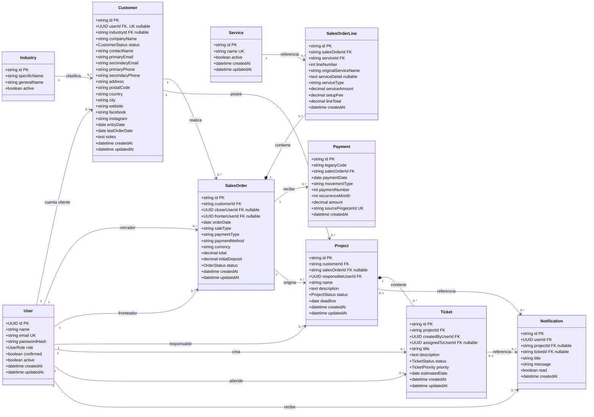

# Propuesta técnica de modelo de datos y migración desde CSV

**Proyecto:** Portal Cliente / TickedApp  
**Objetivo:** Sustituir archivos CSV por una base de datos relacional auditable, consistente y preparada para evolución futura.  
**Alcance:** Clientes, órdenes, servicios, pagos, proyectos, tickets y notificaciones.  
**Fuera del alcance inicial:** Facturación formal e integración operativa con Odoo.

---

## 1. Resumen ejecutivo

Actualmente la operación depende de archivos CSV para consultar clientes, órdenes y pagos. Este enfoque dificulta la trazabilidad, genera duplicidad de datos y aumenta el riesgo de errores al crecer la plataforma.

Se propone migrar a un modelo relacional en PostgreSQL, gestionado desde Prisma, con una normalización pragmática: separar las entidades que hoy aparecen mezcladas en los CSV, pero sin sobrediseñar el MVP.

La propuesta prioriza:

- Preservar los identificadores actuales del negocio (`CS-*`, `OF-*`, `PAY-*`).
- Separar órdenes, líneas de orden y pagos para reflejar correctamente la realidad comercial.
- Evitar duplicidad de clientes, servicios e industrias.
- Mantener compatibilidad con los módulos actuales del portal: usuarios, proyectos, tickets y notificaciones.
- Ejecutar la importación de forma idempotente, es decir, sin duplicar información si se corre más de una vez.
- Dejar una ruta clara para integrar facturas, contratos recurrentes y Odoo en fases posteriores.

La decisión más importante es no usar los códigos de pago importados (`PAY-*`) como clave primaria, porque existen códigos repetidos que representan movimientos financieros diferentes. En su lugar, cada pago tendrá un nuevo identificador interno (`PMT-*`) y conservará el código original como referencia histórica.

---

## 2. Situación actual

### 2.1 Archivos analizados

| Archivo | Contenido principal |
|---|---|
| `Clientes.csv` | Empresas, contactos, ubicación, industria y presencia digital |
| `Ordenes.csv` | Órdenes comerciales y servicios contratados |
| `Pagos.csv` | Pagos iniciales, complementarios, recurrentes y reembolsos |
| `Complementos.csv` | Catálogos para servicios, agentes, industrias y valores controlados |

### 2.2 Hallazgos relevantes

| Métrica | Resultado |
|---|---:|
| Clientes | 170 |
| Identificadores únicos de cliente | 170 |
| Filas de órdenes | 386 |
| Órdenes únicas | 295 |
| Órdenes con más de un servicio | 82 |
| Filas de pagos | 299 |
| Códigos de pago diferentes | 287 |
| Códigos de pago repetidos | 10 |
| Filas de pago sin orden o cliente | 6 |

Conclusiones del análisis:

- El problema principal no es el volumen de datos, sino la estructura.
- Una misma orden puede tener varios servicios, por eso debe separarse en cabecera y líneas.
- Una orden puede tener varios movimientos financieros, por eso los pagos deben ser registros independientes.
- Algunos correos se repiten entre empresas, por lo que no deben usarse como identificadores únicos de cliente.
- No se encontraron referencias huérfanas entre órdenes válidas y clientes.
- No se encontraron referencias huérfanas entre pagos válidos y órdenes.

---

## 3. Decisiones de diseño

### 3.1 Identificadores

Se recomienda mantener dos tipos de identificadores:

| Tipo | Uso | Motivo |
|---|---|---|
| UUID | `User` | Seguridad, autenticación y menor exposición de secuencias internas |
| String personalizado | Entidades de negocio | Trazabilidad con CSV y lectura operativa por el equipo |

Ejemplos de identificadores propuestos:

| Entidad | Ejemplo |
|---|---|
| Customer | `CS-0001` |
| SalesOrder | `OF-2024-0001` |
| SalesOrderLine | `OL-2024-0001` |
| Payment | `PMT-2024-0001` |
| Industry | `IND-0001` |
| Service | `SRV-0001` |
| Project | `PRJ-0001` |
| Ticket | `TICK-0001` |
| Notification | `NTF-0001` |

El código `PAY-*` importado desde CSV debe guardarse en `Payment.legacyCode`, pero no debe ser clave primaria ni único.

### 3.2 Normalización pragmática

La normalización propuesta evita duplicidad importante sin convertir el MVP en una solución demasiado compleja.

Decisiones principales:

- Los datos básicos de contacto y dirección permanecen en `Customer`.
- País y ciudad se almacenan como texto durante el MVP.
- Industrias y servicios se separan en catálogos.
- Las órdenes se dividen en `SalesOrder` y `SalesOrderLine`.
- Los pagos se almacenan como movimientos independientes.
- Facturas, contratos recurrentes y múltiples contactos quedan para fases posteriores.

### 3.3 Datos calculados

No se deben persistir datos que puedan derivarse de una fuente más confiable.

| Dato | Fuente recomendada |
|---|---|
| Año y mes | Fecha de orden o pago |
| Cliente de un pago | `Payment -> SalesOrder -> Customer` |
| Empresa e industria de un pago | Relación con la orden y el cliente |
| Saldo de una orden | `SalesOrder.total - SUM(Payment.amount)` |

---

## 4. Modelo de datos propuesto

### 4.1 Entidades principales

| Entidad | Responsabilidad |
|---|---|
| `User` | Identidad autenticable: clientes con acceso e integrantes internos |
| `Customer` | Empresa cliente importada desde CSV |
| `Industry` | Catálogo de industrias específicas y generales |
| `Service` | Catálogo normalizado de servicios ofrecidos |
| `SalesOrder` | Cabecera comercial de una orden |
| `SalesOrderLine` | Servicio específico incluido en una orden |
| `Payment` | Movimiento financiero asociado con una orden |
| `Project` | Proyecto operativo del portal |
| `Ticket` | Solicitud o incidencia asociada con un proyecto |
| `Notification` | Notificación enviada a un usuario |

### 4.2 Relaciones clave

| Relación | Descripción |
|---|---|
| `Customer -> SalesOrder` | Un cliente puede tener muchas órdenes |
| `SalesOrder -> SalesOrderLine` | Una orden contiene uno o varios servicios |
| `Service -> SalesOrderLine` | Una línea referencia un servicio del catálogo |
| `SalesOrder -> Payment` | Una orden puede recibir múltiples pagos |
| `Customer -> Project` | Un proyecto pertenece a una empresa cliente |
| `SalesOrder -> Project` | Una orden puede originar uno o más proyectos |
| `Project -> Ticket` | Un proyecto puede contener varios tickets |
| `User -> Notification` | Un usuario puede recibir notificaciones |

### 4.3 Diagrama de clases MVP



---

## 5. Justificación por entidad

### 5.1 `User`

Representa una identidad que puede autenticarse o actuar dentro de la aplicación.

Se mantiene separada de `Customer` porque:

- Una empresa puede existir sin tener acceso al portal.
- Los usuarios internos también gestionan proyectos y tickets.
- Las credenciales no deben mezclarse con información comercial importada.
- El UUID evita exponer secuencias predecibles de cuentas.

`Customer.userId` será nullable y único. Esto permite importar todos los clientes antes de crear accesos al portal.

### 5.2 `Customer`

Es la entidad principal para las empresas importadas desde `Clientes.csv`.

Usa el identificador original `CS-*` como clave primaria para conservar trazabilidad, simplificar enlaces con órdenes existentes y evitar una tabla de equivalencias durante el MVP.

No se debe imponer unicidad global a correos o teléfonos, porque varios clientes pueden compartirlos.

### 5.3 `Industry`

Evita repetir nombres de industria específica y general en cada cliente.

Para el MVP se recomienda una sola tabla con restricción única sobre:

```text
UNIQUE(specificName, generalName)
```

Dividir industria específica y general en dos tablas aportaría poco valor en esta primera migración.

### 5.4 `Service`

Centraliza el catálogo oficial de servicios comerciales. Durante la migración no se debe crear un servicio nuevo por cada nombre histórico encontrado en el CSV.

El catálogo oficial queda limitado a:

```text
E-commerce
Servicio Webmaster
Producción audiovisual
Redes sociales
SEO
GBP
Email marketing
PPC
Diseño web
Sitio express
Branding
Otros
```

`Otros` agrupa servicios puntuales o históricos que no pertenecen al catálogo oficial.

Beneficios:

- Evita variaciones ortográficas.
- Permite corregir nombres desde un solo lugar.
- Facilita activar o desactivar servicios.
- Sirve como catálogo para formularios futuros.
- Evita que servicios únicos o excepcionales contaminen el catálogo principal.

### 5.5 `SalesOrder`

Representa la cabecera de una orden comercial.

Debe contener solo información común a toda la orden: cliente, fecha, cerrador, fronteador, tipo de venta, condición de pago, método de pago y total general.

Esta separación permite transformar las 386 filas del CSV en 295 órdenes únicas y sus líneas correspondientes.

### 5.6 `SalesOrderLine`

Representa cada servicio incluido en una orden.

Es necesaria porque 82 órdenes contienen más de un servicio. La combinación recomendada debe ser única:

```text
UNIQUE(salesOrderId, lineNumber)
```

El precio de la línea debe conservarse como valor histórico acordado, sin depender del precio actual del catálogo.

Cuando una línea se clasifica como `Otros`, `SalesOrderLine.originalServiceName` y `SalesOrderLine.serviceDetail` deben conservar el nombre original del CSV. Ese detalle puede usarse posteriormente en la descripción operativa de la orden o del proyecto generado.

### 5.7 `Payment`

Representa cada movimiento financiero asociado con una orden: pago inicial, complemento, recurrencia o reembolso.

Cada movimiento debe conservarse por separado. No se deben sobrescribir pagos anteriores.

Campos clave:

| Campo | Uso |
|---|---|
| `id` | Nuevo identificador interno `PMT-*` |
| `legacyCode` | Código `PAY-*` original del CSV, no único |
| `sourceFingerprint` | Huella única para evitar duplicados de importación |

Huella recomendada:

```text
SHA-256(
  archivo
  + legacyCode
  + salesOrderId
  + paymentDate
  + movementType
  + paymentNumber
  + recurrenceMonth
  + amountNormalizado
)
```

Si el número de fila del CSV es estable, puede incluirse. Si puede cambiar entre exportaciones, debe excluirse.

### 5.8 `Project`, `Ticket` y `Notification`

Estas entidades conservan los módulos actuales del portal.

Cambios recomendados:

- `Project` debe pertenecer a un `Customer` real.
- `Project.salesOrderId` será nullable, porque no toda orden necesariamente genera un proyecto.
- `Ticket` debe distinguir entre usuario creador y usuario asignado.
- `Notification` puede referenciar opcionalmente un proyecto o ticket.

---

## 6. Reglas de integridad y restricciones

### 6.1 Claves únicas recomendadas

```text
User.email
Customer.userId
Industry(specificName, generalName)
Service.name
SalesOrderLine(salesOrderId, lineNumber)
Payment.sourceFingerprint
```

### 6.2 Campos que no deben ser únicos

```text
Customer.primaryEmail
Customer.primaryPhone
Payment.legacyCode
```

### 6.3 Integridad referencial

- No permitir una orden sin cliente.
- No permitir una línea sin orden o servicio.
- No permitir un pago sin una orden válida.
- No permitir un proyecto sin cliente.
- No permitir un ticket sin proyecto.
- No eliminar físicamente clientes con órdenes, pagos o proyectos.
- Usar estados inactivos o archivados para conservar historial.

### 6.4 Tipos monetarios

Todos los importes deben almacenarse como:

```text
DECIMAL(14, 2)
```

No se debe usar `FLOAT` ni almacenar símbolos monetarios.

---

## 7. Reglas de transformación de datos

### 7.1 Fechas

Los valores como `01-02-2024` deben interpretarse explícitamente como:

```text
MM-DD-YYYY
```

Luego deben almacenarse como `DATE`, no como texto.

### 7.2 Importes

Antes de persistir, los importes deben normalizarse:

```text
"$1,079.00" -> 1079.00
"-$380.00"  -> -380.00
"$480.0"    -> 480.00
```

### 7.3 Textos

- Eliminar espacios al inicio y final.
- Convertir cadenas vacías a `NULL`.
- Mantener el texto original visible.
- Crear una versión normalizada solo cuando sea necesaria para comparación.
- No eliminar acentos de los valores mostrados.

### 7.4 Servicios

Los nombres de servicios deben normalizarse antes de buscar registros en `Service`, pero el catálogo final no debe crecer con cada nombre histórico del CSV.

El catálogo oficial de servicios es cerrado y debe contener únicamente:

```text
E-commerce
Servicio Webmaster
Producción audiovisual
Redes sociales
SEO
GBP
Email marketing
PPC
Diseño web
Sitio express
Branding
Otros
```

Los servicios históricos que no correspondan a una categoría oficial deben asociarse a `Otros`. En ese caso, la línea debe conservar el valor original del CSV en `SalesOrderLine.originalServiceName` y `SalesOrderLine.serviceDetail` para poder mostrarlo luego en la descripción operativa de la orden o del proyecto.

Mapeo aplicado durante la migración:

| Valor en CSV | Servicio oficial |
|---|---|
| `Web Design` | `Diseño web` |
| `Web Master Services` | `Servicio Webmaster` |
| `Social Media` | `Redes sociales` |
| `GMB` | `GBP` |
| `Website Express` | `Sitio express` |
| `Producción Video` | `Producción audiovisual` |
| `WooCommerce` | `E-commerce` |
| `Manual de Marca` | `Branding` |
| Cualquier otro servicio no listado | `Otros` |

Ejemplos:

```text
"Web Design" -> Service.name = "Diseño web"
"Limpieza de Malware " -> Service.name = "Otros"
"Limpieza de Malware " -> SalesOrderLine.originalServiceName = "Limpieza de Malware"
"Limpieza de Malware " -> SalesOrderLine.serviceDetail = "Limpieza de Malware"
```

Esta regla permite mantener un catálogo limpio para formularios y reportes, sin perder trazabilidad del servicio específico vendido históricamente.

### 7.5 Usuarios internos

Los nombres de cerradores y fronteadores deben compararse contra usuarios internos usando un nombre normalizado.

Si no hay coincidencia:

- La orden se importa.
- La relación queda temporalmente en `NULL`.
- Se registra una advertencia para revisión.

No se recomienda crear cuentas automáticamente con contraseña para cada nombre encontrado en el CSV.

---

## 8. Estrategia de migración

### Fase 1: respaldo y congelación

1. Crear una copia inmutable de los cuatro CSV.
2. Calcular y registrar un hash SHA-256 de cada archivo.
3. No modificar los archivos originales durante la migración.

### Fase 2: staging

Cargar primero cada fila en tablas temporales o de staging:

```text
staging_customers
staging_orders
staging_payments
```

Cada fila debe conservar:

- Nombre del archivo.
- Número de fila.
- Contenido original.
- Estado de validación.
- Mensaje de error, si aplica.

Estas tablas pueden eliminarse después de la aceptación, aunque conservarlas temporalmente facilita auditoría.

### Fase 3: catálogos

Importar primero:

1. Industrias.
2. Servicios oficiales.
3. Usuarios internos existentes o mapeados.

El catálogo `Service` debe inicializarse con las 11 categorías oficiales más `Otros`. Los servicios no oficiales detectados en `Complementos.csv` u `Ordenes.csv` no deben crearse como nuevos registros de `Service`; deben mapearse a una categoría oficial o a `Otros`.

### Fase 4: clientes

Importar clientes usando `Customer.id` como clave de búsqueda.

La operación debe ser un `upsert`:

```text
si CS-0001 no existe -> crear
si CS-0001 existe    -> actualizar campos permitidos
```

No se deben vincular cuentas `User` automáticamente solo por coincidencia de correo.

### Fase 5: órdenes y líneas

Agrupar las filas de `Ordenes.csv` por `ID Orden`.

Por cada grupo:

1. Validar que cliente, fecha y total general sean consistentes.
2. Crear o actualizar una sola `SalesOrder`.
3. Crear una `SalesOrderLine` por cada servicio vendido.
4. Asignar `lineNumber` según el orden estable de aparición.
5. Asociar cada línea al servicio oficial normalizado.
6. Si la línea cae en `Otros`, conservar el nombre original del CSV en `originalServiceName` y `serviceDetail`.

Validación recomendada:

```text
SUM(lineTotal) ≈ SalesOrder.total
```

Las diferencias esperadas por estructura de setup fees deben registrarse y revisarse, no corregirse silenciosamente.

### Fase 6: pagos

Por cada fila válida:

1. Verificar que la orden exista.
2. Normalizar fecha e importe.
3. Generar `sourceFingerprint`.
4. Omitir la fila si la huella ya existe.
5. Crear un `Payment` con identificador `PMT-*`.
6. Conservar el `PAY-*` original en `legacyCode`.

Las 6 filas sin orden o cliente deben enviarse a un reporte de incidencias y no insertarse como pagos válidos.

### Fase 7: conciliación

Antes de aprobar la migración se deben comparar los conteos esperados:

| Validación | Resultado esperado |
|---|---:|
| Clientes | 170 |
| Órdenes únicas | 295 |
| Líneas de orden | 386 |
| Filas de pago revisadas | 299 |
| Filas de pago incompletas | 6 |

Para cada orden:

```text
paidAmount = SUM(Payment.amount)
balance = SalesOrder.total - paidAmount
```

Los totales deben compararse con los datos históricos. No se debe asumir que todas las órdenes posteriores a enero de 2025 tienen pagos registrados, porque el CSV de pagos está incompleto respecto al CSV de órdenes.

---

## 9. Idempotencia

La migración debe poder ejecutarse nuevamente sin duplicar información.

Reglas propuestas:

| Entidad | Estrategia |
|---|---|
| `Customer` | `upsert` por `id` |
| `Industry` | `upsert` por industria específica y general normalizadas |
| `Service` | `upsert` solo por nombre oficial |
| `SalesOrder` | `upsert` por `id` |
| `SalesOrderLine` | `upsert` por orden y número de línea |
| `Payment` | Crear solo si `sourceFingerprint` no existe |

Cada ejecución debe producir un resumen:

```text
creados
actualizados
omitidos por duplicidad
rechazados
advertencias
```

---

## 10. Recomendaciones para Prisma y PostgreSQL

### 10.1 Convenciones de nombres

Usar modelos Prisma en singular y tablas PostgreSQL en plural mediante `@@map`.

```prisma
model Customer {
  id          String @id @db.VarChar(32)
  companyName String @db.VarChar(180)

  @@map("customers")
}
```

### 10.2 Longitud de identificadores

Reservar `VARCHAR(32)` para identificadores de negocio. Aunque los códigos actuales son cortos, esto permite incorporar prefijos, años o secuencias más largas.

### 10.3 Índices recomendados

```text
customers.industry_id
sales_orders.customer_id
sales_orders.order_date
sales_order_lines.sales_order_id
payments.sales_order_id
payments.payment_date
projects.customer_id
tickets.project_id
tickets.assigned_to_user_id
notifications.user_id
```

### 10.4 Transacciones

Cada unidad lógica debe importarse dentro de una transacción:

- Un cliente.
- Una orden junto con todas sus líneas.
- Un pago.

Si falla una línea de una orden, no debe quedar una cabecera incompleta.

### 10.5 Borrado y conservación histórica

Evitar `ON DELETE CASCADE` desde clientes hacia órdenes o pagos.

Puede utilizarse cascade en:

- Orden hacia sus líneas.
- Proyecto hacia tickets, si la regla funcional lo permite.

Para información histórica y financiera se recomienda usar `RESTRICT` o archivado lógico.

---

## 11. Riesgos y mitigaciones

| Riesgo | Impacto | Mitigación |
|---|---|---|
| Códigos de pago repetidos | Duplicidad o pérdida de movimientos | Usar `Payment.id` nuevo y `legacyCode` solo como referencia |
| Fechas ambiguas | Importes asociados a periodos incorrectos | Definir formato `MM-DD-YYYY` antes de migrar |
| Correos compartidos entre empresas | Asociación incorrecta de usuarios | No vincular `User` por correo sin validación |
| Pagos sin orden o cliente | Registros financieros inválidos | Enviar a reporte de incidencias |
| Usuarios internos no encontrados | Órdenes incompletas | Importar orden con usuario nullable y advertencia |
| Diferencias entre total de orden y líneas | Conciliación incorrecta | Reportar diferencias y revisarlas manualmente |
| Servicios históricos no oficiales | Catálogo difícil de mantener | Mapear a `Otros` y conservar detalle original en `SalesOrderLine` |

---

## 12. Evolución futura

### 12.1 Facturas

Cuando el módulo sea necesario, se puede añadir:

```text
Customer -> Invoice
SalesOrder -> Invoice
Invoice -> PaymentAllocation <- Payment
```

No es necesario introducir estas tablas para migrar los CSV actuales.

### 12.2 Integración con Odoo

La integración puede incorporarse después de estabilizar el modelo base.

Sincronización recomendada:

- Clientes desde `Customer`.
- Órdenes desde `SalesOrder` y `SalesOrderLine`.
- Pagos desde `Payment`.
- Facturas cuando exista el módulo `Invoice`.

La comunicación debería manejarse con procesos controlados y trazables, no con escritura directa no auditada sobre las tablas operativas.

### 12.3 Múltiples contactos

Si una empresa necesita varios contactos estructurados, los campos actuales de `Customer` pueden migrarse posteriormente a:

```text
CustomerContact
ContactChannel
```

Esta evolución no obliga a cambiar órdenes, pagos, proyectos o tickets.

### 12.4 Contratos recurrentes

Los servicios mensuales podrían generar una entidad `ServiceContract` en una fase posterior. Para el MVP, la recurrencia histórica puede identificarse mediante líneas de orden y movimientos de pago.

---

## 13. Conclusión

El esquema propuesto permite abandonar los CSV como fuente operativa sin introducir complejidad innecesaria.

Las decisiones técnicas esenciales son:

- UUID solo para identidades autenticadas.
- Identificadores personalizados para entidades de negocio.
- Separación obligatoria entre órdenes y líneas de orden.
- Catálogo oficial de servicios con `Otros` para excepciones históricas.
- Pagos independientes con huella única de importación.
- Cliente como propietario real de órdenes y proyectos.
- Usuario como identidad de acceso y operación.
- Migración por staging, validación, `upsert` y conciliación.

Esta estructura mejora trazabilidad, reduce duplicidad, conserva el historial financiero y deja preparada la plataforma para integrar facturación, Odoo, múltiples contactos y contratos recurrentes en fases posteriores.
