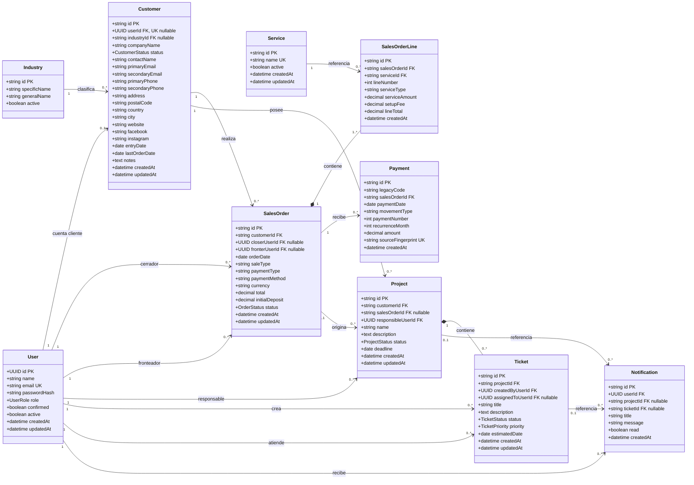

# Propuesta de esquema de datos y migración de CSV

## 1. Objetivo

Esta propuesta define una base de datos relacional para sustituir los archivos CSV usados actualmente como fuente de datos de clientes, órdenes y pagos.

El alcance inicial busca:

- Migrar los datos existentes sin duplicarlos.
- Eliminar redundancia innecesaria.
- Mantener los módulos actuales del prototipo de la plataforma: usuarios, proyectos, tickets y notificaciones.
- Conservar los identificadores personalizados presentes en los CSV.
- Permitir que el proceso de importación pueda ejecutarse más de una vez de forma segura.
- Evitar complejidad prematura.

Las facturas y la integración con Odoo quedan fuera de esta primera migración. Podrán incorporarse posteriormente sin reemplazar las entidades principales.

## 2. Contexto de los datos

Los archivos analizados contienen:

| Archivo | Contenido |
|---|---|
| `Clientes.csv` | Empresas, contactos, ubicación, industria y presencia digital |
| `Ordenes.csv` | Órdenes comerciales y servicios contratados |
| `Pagos.csv` | Pagos iniciales, complementarios, recurrentes y reembolsos |
| `Complementos.csv` | Catálogos utilizados para validar servicios, agentes, industrias y otros valores |

Resultados importantes del análisis:

- Existen 170 clientes con 170 identificadores únicos.
- Existen 386 filas de órdenes, pero solamente 295 órdenes únicas.
- 82 órdenes incluyen más de un servicio.
- Existen 299 filas de pagos y 287 códigos de pago diferentes.
- Hay 10 códigos de pago repetidos.
- Algunos códigos de pago repetidos representan movimientos diferentes y válidos.
- Existen 6 filas de pagos sin información de orden o cliente.
- No se encontraron referencias huérfanas entre las órdenes válidas y los clientes.
- No se encontraron referencias huérfanas entre los pagos válidos y sus órdenes.
- Algunos correos están asociados con más de una empresa y no pueden utilizarse como identificadores únicos de clientes.

La dificultad principal no es el volumen, sino separar correctamente la información repetida y preservar el historial financiero.

## 3. Criterios de diseño

### 3.1 Identificadores

`User` conservará un UUID porque representa una identidad de autenticación y seguridad.

Las entidades de negocio utilizarán identificadores personalizados de tipo `string`, administrados por un gestor de identificadores de la aplicación.

| Entidad | Ejemplo |
|---|---|
| Customer | `CS-0001` |
| SalesOrder | `OF-2024-0001` |
| SalesOrderLine | `OL-2024-0001` |
| Payment | `PMT-2024-0001` |
| Industry | `IND-0001` |
| Service | `SRV-0001` |
| Project | `PRJ-0001` |
| Ticket | `TICK-0001` |
| Notification | `NTF-0001` |

El identificador `PAY-*` importado desde el CSV no puede ser la clave primaria de `Payment`, debido a que aparece repetido en movimientos distintos. Se conservará en `legacyCode`.

### 3.2 Normalización pragmática

El esquema busca evitar duplicación importante sin fragmentar excesivamente la información.

Por esta razón:

- Los datos básicos de contacto y dirección permanecen dentro de `Customer`.
- País y ciudad se almacenan como texto durante el MVP.
- Métodos de pago, tipos de movimiento y tipos de venta pueden comenzar como valores controlados o enums.
- Las órdenes y sus líneas sí deben estar separadas porque una orden puede incluir varios servicios.
- Los pagos deben ser registros independientes porque una orden puede recibir múltiples movimientos.

### 3.3 Datos calculados

No deben almacenarse campos que puedan derivarse de una fuente más confiable.

Ejemplos:

- Año y mes se calculan desde la fecha.
- El cliente de un pago se obtiene mediante `Payment -> SalesOrder -> Customer`.
- Empresa e industria no se repiten en órdenes ni pagos.
- El saldo de una orden se calcula a partir de su total y sus pagos.

## 4. Diagrama de clases MVP



## 5. Justificación de cada tabla

### 5.1 `User`

Representa exclusivamente una identidad que puede autenticarse o actuar dentro de la aplicación.

Se mantiene separada de `Customer` porque:

- Una empresa puede existir sin tener acceso al portal.
- Los usuarios internos también gestionan proyectos y tickets.
- Las credenciales no deben mezclarse con información comercial importada.
- El UUID evita exponer una secuencia predecible de cuentas.

`Customer.userId` será nullable y único. Esto permite importar todos los clientes antes de crearles cuentas.

### 5.2 `Customer`

Es la entidad principal para las empresas importadas desde `Clientes.csv`.

Conserva el identificador original `CS-*` como clave primaria para:

- Facilitar la trazabilidad con el CSV.
- Simplificar el enlace con órdenes existentes.
- Evitar una tabla adicional de equivalencias durante el MVP.

Los datos de contacto se mantienen en esta tabla para reducir complejidad. Si en el futuro una empresa requiere múltiples contactos formales, se podrá extraer una tabla `CustomerContact`.

No se debe imponer unicidad global a correos o teléfonos, ya que varios clientes pueden compartirlos.

### 5.3 `Industry`

Evita repetir los nombres de industria específica y general en cada cliente.

Se recomienda una sola tabla en el MVP porque la relación entre industria específica y general ya está definida en los datos. Dividirla en dos tablas aportaría poco valor durante la primera migración.

Restricción recomendada:

```text
UNIQUE(specificName, generalName)
```

### 5.4 `Service`

Representa el catálogo de servicios como SEO, PPC, Web Design y Social Media.

Es necesaria porque los nombres se repiten en muchas órdenes. Centralizarlos permite:

- Corregir nombres sin modificar cientos de líneas.
- Evitar variaciones ortográficas.
- Activar o desactivar servicios.
- Usar el catálogo en formularios de la aplicación.

El nombre normalizado debe ser único.

### 5.5 `SalesOrder`

Representa la cabecera de una orden.

Contiene únicamente información común a toda la orden:

- Cliente.
- Fecha.
- Cerrador y fronteador.
- Tipo de venta.
- Condición y método de pago.
- Total general.

No debe repetirse por cada servicio. Esta separación transforma las 386 filas del CSV en 295 cabeceras de orden y sus correspondientes líneas.

Los campos `closerUserId` y `fronterUserId` son nullable porque los nombres del CSV deberán vincularse con usuarios internos existentes. Una migración no debe fallar completamente si todavía no existe ese usuario.

### 5.6 `SalesOrderLine`

Representa cada servicio incluido en una orden.

Es indispensable porque 82 órdenes contienen más de un servicio.

La combinación siguiente debe ser única:

```text
UNIQUE(salesOrderId, lineNumber)
```

El total de la línea se conserva porque contiene el precio comercial acordado en ese momento. No debe depender del precio actual del catálogo de servicios.

### 5.7 `Payment`

Representa un movimiento financiero asociado con una orden.

Cada pago inicial, complemento, recurrencia o reembolso debe conservarse como un movimiento separado. No se deben sobrescribir pagos anteriores.

`legacyCode` almacena el código `PAY-*` del CSV, pero no será único porque se encontraron códigos reutilizados.

`sourceFingerprint` será único y permitirá detectar si una fila ya fue importada.

Una huella recomendada es:

```text
SHA-256(
  archivo
  + numeroFila
  + legacyCode
  + salesOrderId
  + paymentDate
  + movementType
  + paymentNumber
  + recurrenceMonth
  + amountNormalizado
)
```

Si el número de fila puede cambiar entre exportaciones, debe excluirse y utilizarse una combinación estable de los demás campos.

El cliente, la empresa, la industria, el total de la orden y el saldo no deben repetirse en esta tabla.

### 5.8 `Project`

Mantiene el módulo actual de proyectos de TickedApp.

Se agrega `customerId` para que el proyecto pertenezca a una empresa real y no solamente a un usuario responsable.

`salesOrderId` será nullable porque:

- Algunos proyectos pueden crearse manualmente.
- No toda orden necesita producir un proyecto.
- La regla de creación puede definirse posteriormente según el servicio.

`responsibleUserId` conserva la relación con el usuario interno responsable.

### 5.9 `Ticket`

Mantiene el módulo actual denominado `Ticked` en parte del código. Se recomienda estandarizar su nombre como `Ticket`.

Cada ticket pertenece a un proyecto y distingue:

- El usuario que creó la solicitud.
- El usuario interno asignado para atenderla.

Esta separación evita confundir al cliente que reporta un problema con el empleado que lo resuelve.

### 5.10 `Notification`

Mantiene el sistema actual de notificaciones.

Puede referenciar opcionalmente un proyecto o ticket. No necesita almacenar datos comerciales de clientes, órdenes o pagos.

## 6. Restricciones recomendadas

### Claves únicas

```text
User.email
Customer.userId
Industry(specificName, generalName)
Service.name
SalesOrderLine(salesOrderId, lineNumber)
Payment.sourceFingerprint
```

No deben ser únicos:

```text
Customer.primaryEmail
Customer.primaryPhone
Payment.legacyCode
```

### Integridad referencial

- No permitir una orden sin cliente.
- No permitir una línea sin orden o servicio.
- No permitir un pago sin una orden válida.
- No permitir un proyecto sin cliente.
- No permitir un ticket sin proyecto.
- No eliminar físicamente clientes que tengan órdenes, pagos o proyectos.
- Utilizar estados inactivos o archivados para conservar el historial.

### Tipos monetarios

Todos los importes deben usar:

```text
DECIMAL(14, 2)
```

No se debe utilizar `FLOAT` ni almacenar símbolos monetarios.

## 7. Reglas de transformación

### Fechas

Los valores como `01-02-2024` deben interpretarse explícitamente como:

```text
MM-DD-YYYY
```

Después deben almacenarse como `DATE`, no como texto.

### Importes

Antes de persistir:

```text
"$1,079.00" -> 1079.00
"-$380.00"  -> -380.00
"$480.0"    -> 480.00
```

### Textos

- Eliminar espacios al inicio y al final.
- Convertir cadenas vacías a `NULL`.
- Mantener el texto original visible.
- Crear una versión normalizada solamente cuando sea necesaria para comparación.
- No eliminar acentos de los valores mostrados.

### Servicios

Los nombres deben normalizarse antes de buscar o crear un `Service`.

Ejemplo:

```text
"Limpieza de Malware "
"Limpieza de Malware"
```

Ambos deben apuntar al mismo servicio.

### Usuarios internos

Los nombres de cerradores y fronteadores se deben comparar contra usuarios internos usando un nombre normalizado.

Si no existe una coincidencia:

- La orden se importa.
- La relación queda temporalmente en `NULL`.
- Se registra una advertencia para revisión.

No se recomienda crear automáticamente una cuenta con contraseña para cada nombre encontrado en el CSV.

## 8. Estrategia de migración

### Fase 1: respaldo y congelación

1. Crear una copia inmutable de los cuatro CSV.
2. Calcular y registrar un hash SHA-256 de cada archivo.
3. No modificar los archivos originales durante la migración.

### Fase 2: staging

Se recomienda cargar primero cada fila en tablas temporales o de staging:

```text
staging_customers
staging_orders
staging_payments
```

Cada fila debe conservar:

- Nombre del archivo.
- Número de fila.
- Contenido original.
- Estado de validación.
- Mensaje de error, si aplica.

Estas tablas pueden eliminarse cuando la migración haya sido aceptada, aunque conservarlas temporalmente facilita la auditoría.

### Fase 3: catálogos

Importar primero:

1. Industrias.
2. Servicios.
3. Usuarios internos ya existentes o mapeados.

### Fase 4: clientes

Importar clientes usando `Customer.id` como clave de búsqueda.

La operación debe ser un `upsert`:

```text
si CS-0001 no existe -> crear
si CS-0001 existe    -> actualizar campos permitidos
```

No vincular automáticamente cuentas `User` únicamente por coincidencia de correo. El vínculo debe confirmarse para evitar asociar una cuenta con la empresa incorrecta.

### Fase 5: órdenes y líneas

Agrupar las filas de `Ordenes.csv` por `ID Orden`.

Por cada grupo:

1. Validar que cliente, fecha y total general sean consistentes.
2. Crear o actualizar una sola `SalesOrder`.
3. Crear una `SalesOrderLine` por cada servicio.
4. Asignar `lineNumber` según el orden estable de aparición.

La importación debe validar:

```text
SUM(lineTotal) ≈ SalesOrder.total
```

Las diferencias esperadas por estructura de setup fees deben registrarse y revisarse, no corregirse silenciosamente.

### Fase 6: pagos

Por cada fila válida:

1. Verificar que la orden exista.
2. Normalizar fecha e importe.
3. Generar `sourceFingerprint`.
4. Omitir la fila si la huella ya existe.
5. Crear un `Payment` con un nuevo identificador `PMT-*`.
6. Conservar el `PAY-*` original en `legacyCode`.

Las 6 filas sin orden o cliente deben enviarse a un reporte de incidencias y no insertarse como pagos válidos.

### Fase 7: conciliación

Antes de aprobar la migración se deben comparar:

| Validación | Resultado esperado |
|---|---:|
| Clientes | 170 |
| Órdenes únicas | 295 |
| Líneas de orden | 386 |
| Filas de pago revisadas | 299 |
| Filas de pago incompletas | 6 |

Para cada orden:

```text
paidAmount = SUM(Payment.amount)
balance = SalesOrder.total - paidAmount
```

Los totales deben compararse con los datos históricos, pero no se debe asumir que todas las órdenes posteriores a enero de 2025 tienen pagos registrados, porque el CSV de pagos está incompleto respecto al de órdenes.

## 9. Idempotencia

Una migración idempotente puede ejecutarse nuevamente sin duplicar información.

Reglas:

- `Customer`: upsert por `id`.
- `Industry`: upsert por industria específica y general normalizadas.
- `Service`: upsert por nombre normalizado.
- `SalesOrder`: upsert por `id`.
- `SalesOrderLine`: upsert por orden y número de línea.
- `Payment`: crear únicamente si `sourceFingerprint` no existe.

Cada ejecución debería producir un resumen:

```text
creados
actualizados
omitidos por duplicidad
rechazados
advertencias
```

## 10. Recomendaciones para Prisma y PostgreSQL

### Nombres

Utilizar nombres de modelos en singular y tablas en plural mediante `@@map`.

Ejemplo:

```prisma
model Customer {
  id          String @id @db.VarChar(20)
  companyName String @db.VarChar(180)

  @@map("customers")
}
```

### Longitud de identificadores

Aunque los códigos actuales son cortos, se recomienda reservar:

```text
VARCHAR(32)
```

Esto permite incorporar año, prefijos o secuencias más largas.

### Índices

Crear índices en:

```text
customers.industry_id
sales_orders.customer_id
sales_orders.order_date
sales_order_lines.sales_order_id
payments.sales_order_id
payments.payment_date
projects.customer_id
tickets.project_id
tickets.assigned_to_user_id
notifications.user_id
```

### Transacciones

Importar cada unidad lógica dentro de una transacción:

- Un cliente.
- Una orden junto con todas sus líneas.
- Un pago.

Si falla una línea de una orden, no debe quedar una cabecera incompleta.

### Borrado

Evitar `ON DELETE CASCADE` desde clientes hacia órdenes o pagos.

Puede utilizarse cascade en:

- Orden hacia sus líneas.
- Proyecto hacia tickets, si la regla funcional lo permite.

Para información histórica y financiera se recomienda usar `RESTRICT` o archivado lógico.

## 11. Evolución futura

### Facturas

Cuando el módulo sea necesario, puede añadirse:

```text
Customer -> Invoice
SalesOrder -> Invoice
Invoice -> PaymentAllocation <- Payment
```

No es necesario introducir estas tablas para migrar los CSV actuales.

### Múltiples contactos

Si una empresa necesita varios contactos estructurados, los campos de contacto de `Customer` pueden migrarse posteriormente a:

```text
CustomerContact
ContactChannel
```

Esta evolución no obliga a cambiar órdenes, pagos, proyectos o tickets.

### Contratos recurrentes

Los servicios mensuales podrían generar una entidad `ServiceContract` en una fase posterior. Para el MVP, la recurrencia histórica puede identificarse mediante las líneas de orden y los movimientos de pago.

## 12. Conclusión

El esquema propuesto reduce la migración a las entidades necesarias y conserva los módulos funcionales de TickedApp.

Las decisiones esenciales son:

- UUID únicamente para identidades autenticadas.
- Identificadores personalizados para entidades de negocio.
- Separación obligatoria entre órdenes y líneas.
- Pagos independientes con huella única de importación.
- Cliente como propietario real de órdenes y proyectos.
- Usuario como identidad de acceso y operación.
- Migración por staging, validación, upsert y conciliación.

Esta estructura permite abandonar los CSV como base operativa sin introducir una arquitectura excesivamente compleja y deja una ruta clara para añadir facturas, contactos avanzados y otras integraciones en fases posteriores.
